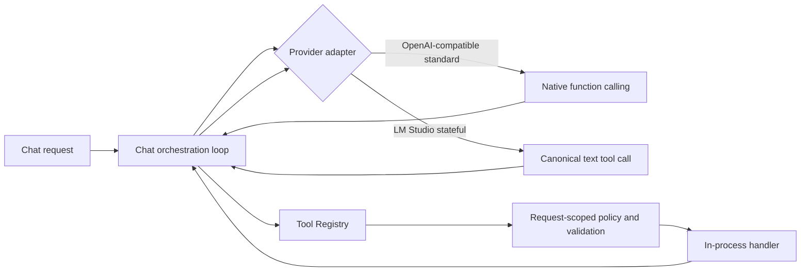

# App Tool Runtime

DKST LLM Chat Server는 모델 공급자에 도구 실행을 위임하지 않습니다. 도구 카탈로그, 사용자별 정책, 인자 검증, 실행과 결과 반환을 모두 앱 프로세스가 담당합니다.

## 책임 경계

- `internal/toolruntime`: 도구 등록, 조회, 사용자별 노출 필터, 필수 인자 검증, 실행을 담당합니다.
- `internal/chatharness`: 공급자 요청 형식과 스트리밍 tool call 조립, tool result 후속 요청을 담당합니다.
- `internal/core/server.go`: 요청 단위 실행 컨텍스트를 만들고 제한된 순차 도구 루프를 오케스트레이션합니다.
- `internal/promptkit`: 네이티브 custom tools를 지원하지 않는 stateful 경로에 동일한 도구 카탈로그와 단일 canonical 호출 형식을 제공합니다.
- `internal/mcp`: 기존 도구 구현과 메모리 저장소가 남아 있는 내부 패키지 이름입니다. 외부 MCP 서버나 전역 사용자 컨텍스트로 사용하지 않습니다.

## 공급자 동작

- OpenAI-compatible `standard`: Chat Completions `tools`를 전송하고, 스트리밍 `tool_calls`를 index별로 합친 뒤 `role: tool`과 `tool_call_id`로 결과를 돌려줍니다.
- LM Studio `stateful`: `/api/v1/chat`의 대화 상태를 유지하면서 `<tool_name>{...}</tool_name>` 형식을 사용합니다. 예를 들어 현재 시간은 `<get_current_time>{}</get_current_time>`으로 호출하며, 앱이 이를 실행하고 같은 stateful 대화에 결과를 반환합니다.
- LM Studio가 도구 호출문을 `message.delta`와 `chat.end.result.output`에 중복해서 보내더라도 Gateway는 호출문을 UI에 전달하지 않고 한 번만 실행합니다.
- 일부 로컬 모델이 `<tool_name>{...}</tool_name>` 대신 `tool_name(key="value")` 형태를 출력하는 경우에도 등록된 도구 이름만 인식하여 JSON 인자로 정규화하고 실행합니다.
- 도구 실행 후 후속 요청에는 원래 사용자 요청과 응답 언어 유지 조건을 함께 전달하므로, 도구 결과가 영어여도 답변 언어가 바뀌지 않습니다.
- `execute_command`는 런타임 OS에 맞는 명령 가이드를 사용합니다. Darwin/BSD, Linux/GNU, Windows/PowerShell을 구분하며, 명령 실패는 성공으로 처리하지 않고 stderr와 함께 모델에 반환하여 안전한 플랫폼별 대안을 직접 재시도하게 합니다.
- 두 경로 모두 같은 Registry와 사용자별 `disabled_tools`, 메모리 사용 여부, 명령/디렉터리 제한을 사용합니다.
- Terminal Assistant 전용 `send_keys`, `read_terminal_tail`은 Gateway Registry에 노출하지 않습니다.

## 새 도구 추가

현재 전환 단계에서는 다음 순서로 추가합니다.

1. `internal/mcp.GetToolList`에 이름, 설명, JSON Schema를 추가합니다.
2. `internal/mcp.ExecuteToolWithContext`에 구현을 연결합니다. 사용자나 위치 같은 상태는 반드시 전달된 `ToolContext`만 사용합니다.
3. 필요하면 `internal/toolruntime.metadataFor`에 카테고리, 읽기 전용 여부, 메모리 요구 여부를 지정합니다.
4. Registry 목록/정책/실행 테스트와 공급자 요청 fixture를 추가합니다.

장기적으로 각 도구를 독립 패키지의 `Definition + Handler`로 직접 등록하면 기존 `internal/mcp` 이름과 switch dispatcher도 제거할 수 있습니다. 공급자 어댑터와 오케스트레이션 계층은 변경할 필요가 없습니다.

## 안전 원칙

- 사용자, 위치, 비활성 도구, 명령 제한은 전역 상태가 아니라 매 요청의 `ExecutionContext`로 전달합니다.
- 클라이언트가 보낸 `tools`/`functions` 제어값은 제거하고 앱 Registry에서 필터링한 카탈로그만 공급자에 전달합니다.
- 서버가 `parallel_tool_calls: false`를 보내며 한 번에 하나의 호출만 실행합니다.
- 도구가 비활성화되었거나 필수 인자가 없으면 handler 진입 전에 실패합니다.
- 외부 `/mcp/sse`, `/mcp/messages` transport는 제공하지 않습니다.
