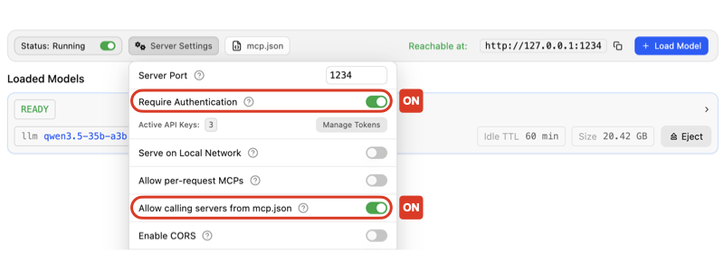
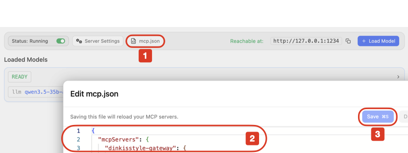

<!--lang:en-->
The **DKST LLM Chat Server** provides various MCP (Model Context Protocol) tools.
To integrate **LM Studio** with these tools, you need to configure the settings **within the LM Studio application** as follows:

---

# 🛠️ LM Studio Integration Procedure

## 1. Access Developer Settings
Navigate to the **Developer Tab** in LM Studio
> `Ctrl + 2` (Windows/Linux)
> `Cmd + 2` (macOS)

## 2. Configure Server Settings
Click on **Server Settings** and enable the following toggle switches:
* **Require Authentication** ON
* **Allow calling servers from mcp.json** ON

 
  

## 3. Update Configuration File
Click on **mcp.json** 1to open the editor, then:
* Copy and paste2 the required JSON configuration into the **Edit mcp.json** field.
* **Save** 3the file to apply the changes.

 
  
<!--/lang-->

<!--lang:ko-->
**DKST LLM Chat Server**는 여러 MCP(Model Context Protocol) 도구를 제공합니다.
이 도구들을 **LM Studio**와 연결하려면 **LM Studio 앱 내부에서** 아래와 같이 설정해야 합니다.

---

# 🛠️ LM Studio 연동 절차

## 1. 개발자 설정 열기
LM Studio에서 **Developer Tab**으로 이동하세요.
* Windows/Linux: `Ctrl + 2`
* macOS: `Cmd + 2`

## 2. 서버 설정 변경
**Server Settings**를 열고 아래 항목을 활성화하세요.
* **Require Authentication** ON
* **Allow calling servers from mcp.json** ON

 
  

## 3. 설정 파일 수정
**mcp.json** 1 을 열고:
* 아래 JSON 을 복사해서 **Edit mcp.json** 2 영역에 붙여 넣은 뒤
* **Save** 3를 눌러 적용하세요.

 
 
<!--/lang-->
