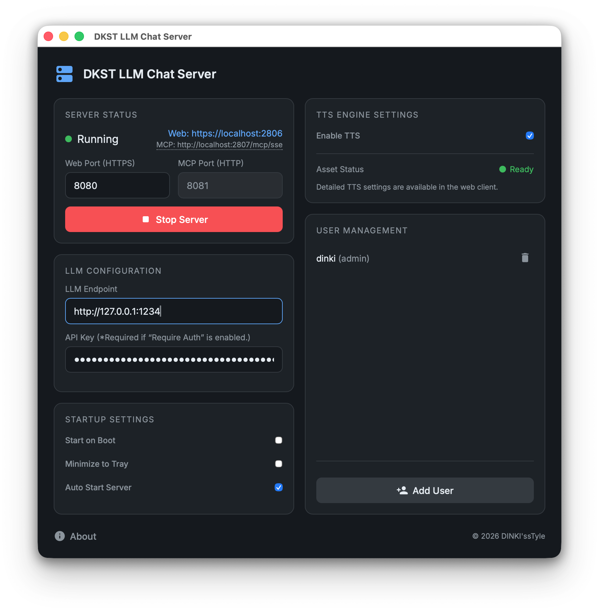

<!--
Created by DINKIssTyle on 2026.
Copyright (C) 2026 DINKI'ssTyle. All rights reserved.
-->

  

# DINKIssTyle Local LLM Gateway with TTS & MCP

**DINKIssTyle Local LLM Gateway**는 개인 정보 보호와 지능형 기능을 결합한 **최첨단 로컬 LLM 웹 챗봇**입니다. 단순히 로컬 LLM(LM Studio, Ollama 등)의 API를 중계하는 게이트웨이를 넘어, 독자적인 **MCP(Model Context Protocol)** 툴킷과 **고성능 TTS**를 통합하여 인터넷 연결 없이도 강력한 개인 비서 경험을 제공합니다.

  

## 핵심 가치 (Core Values)

1.  **로컬 웹 챗봇 솔루션**: 별도의 설치 없이 브라우저만으로 로컬 LLM과 대화할 수 있는 모던한 챗봇 UI를 제공합니다.
2.  **프라이버시 보호**: 모든 데이터와 대화 내용은 사용자의 컴퓨터 내에서만 처리되며, 외부 클라우드로 전송되지 않습니다.
3.  **지능형 확장 (MCP)**: AI 모델이 직접 웹을 검색하거나 사용자의 개인적인 사실들을 기억하고 기록할 수 있는 능력을 부여합니다.

## 주요 기능 (Key Features)

### 1. 지능형 MCP 도구 세트 (Expanded AI Capabilities)
AI 모델에게 '눈'과 '기억'을 제공하는 강력한 도구들이 포함되어 있습니다.
*   **실시간 웹 검색 (`search_web`)**: DuckDuckGo를 통해 최신 정보를 검색하여 답변의 정확도를 높입니다.
*   **웹 페이지 정밀 읽기 (`read_web_page`)**: 특정 URL의 콘텐츠를 직접 읽어 요약하거나 분석합니다.
*   **장기 기억 시스템 (`personal_memory`)**: 사용자의 선호도, 이름, 중요한 사실들을 저장(`remember`)하고 언제든 다시 조회(`query`)합니다.
*   **문서 가이드 (`read_user_document`)**: `personal.md`, `work.md` 등 사용자의 워크스페이스 문서를 AI가 직접 읽고 비즈니스 지침이나 개인에 맞춰 답변합니다.

### 2. 고성능 STT & TTS
*   **STT (음성 인식)**: 안드로이드 및 데스크톱 브라우저의 마이크를 통한 실시간 음성 입력. 자동 전송 기능으로 핸즈프리 대화가 가능합니다.
*   **TTS (음성 합성)**: Supertonic 엔진 기반의 자연스러운 목소리. CPU 사용에 최적화된 멀티스레딩 합성 기술이 적용되었습니다.

### 3. 멀티모달 비전 지원
*   이미지를 채팅창에 붙여넣기만 하면 AI가 즉시 분석합니다. (LM Studio Vision 모델 지원)

## 설치 및 빌드 (Installation & Build)

### 전제 조건
*   [Go](https://go.dev/) 1.18 이상
*   [Node.js](https://nodejs.org/) (npm)
*   Wails CLI 도구 설치: `go install github.com/wailsapp/wails/v2/cmd/wails@latest`

### 빌드 방법
**macOS:** `./build_macos.sh` | **Windows:** `build_windows.bat` | **Linux:** `./build_linux.sh`

## 사용법 (Usage)

1.  앱 실행 후 **Start Server**를 클릭합니다.
    *   **챗봇 접속 (UI)**: `https://localhost:8080` (STT 및 이미지 지원)
    *   **API/MCP 연결**: `http://localhost:8081` (LM Studio 등 외부 앱 연동 시)
2.  **Settings**에서 연동할 로컬 LLM 주소를 입력합니다 (예: `http://localhost:1234`).
3.  채팅창에서 질문하거나, 이미지를 붙여넣어 비전 기능을 테스트하고, "내 생일은 1월 1일이야" 같이 말해 AI의 기억력을 확인해 보세요.

## 라이선스 (License)

Created by DINKIssTyle on 2026.
Copyright (C) 2026 DINKI'ssTyle. All rights reserved.
