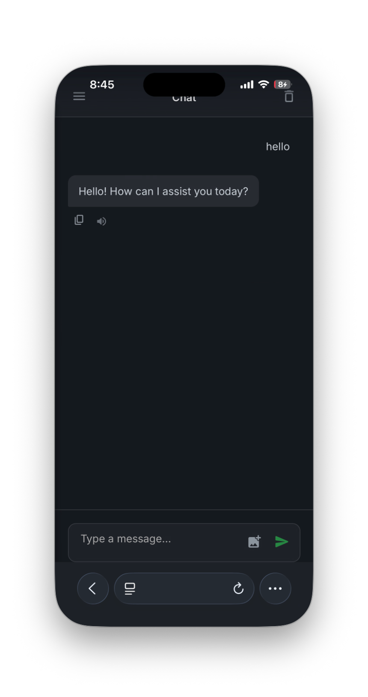

<!--
Created by DINKIssTyle on 2026.
Copyright (C) 2026 DINKI'ssTyle. All rights reserved.
-->

<p align="center">
  
</p>

# DINKIssTyle Local LLM Gateway with TTS

<p align="center">
  
</p>

<p align="center">
  
</p>

**DINKIssTyle Local LLM Gateway with TTS**는 로컬 LLM(Large Language Model)과의 연동 및 고품질 TTS(Text-to-Speech) 엔진인 [Supertonic — Lightning Fast, On-Device TTS](https://github.com/supertone-inc/supertonic)를 통합하여 제공하는 게이트웨이 서버입니다. [Wails](https://wails.io) 프레임워크를 기반으로 Go(백엔드)와 HTML/JS(프론트엔드)를 사용하여 개발되었습니다.

## 주요 기능 (Key Features)

*   **로컬 LLM 게이트웨이**: 로컬에서 실행되는 LLM 서버(예: LM Studio, Ollama 같은 도구)와 연결하여 API 요청을 처리하고 관리합니다.
    *   기본 LLM 엔드포인트: `http://127.0.0.1:1234`
*   **고성능 TTS 통합**: [Supertonic](https://github.com/supertone-inc/supertonic) 엔진을 기반으로 ONNX Runtime을 활용하여, 인터넷 연결 없이도 빠르고 자연스러운 음성 합성이 가능합니다.
    *   다양한 음성 스타일 파일(`assets/voice_styles` 내 JSON 설정) 지원
    *   음성 속도 조절 가능
    *   필요한 음성 모델 에셋 자동 다운로드 및 관리
*   **사용자 관리 시스템**: 게이트웨이 사용자를 위한 ID/PW 기반 인증 및 역할(Role) 관리 기능을 제공합니다.
*   **간편한 GUI 설정**: 서버 포트, LLM 주소, TTS 활성화 여부 등을 GUI 환경에서 손쉽게 설정하고 저장할 수 있습니다.
*   **크로스 플랫폼 지원**: macOS, Windows, Linux 환경에서 모두 실행 가능합니다.

## 디렉토리 구조 (Structure)

*   `app.go`: 애플리케이션 수명 주기 관리 및 Wails 바인딩 함수
*   `server.go`: 로컬 HTTP 게이트웨이 서버 로직
*   `tts.go`: ONNX Runtime 기반 TTS 처리 로직
*   `auth.go`: 사용자 인증 및 관리 로직
*   `frontend/`: 웹 기반 사용자 인터페이스 리소스 (HTML, JS, CSS)
*   `onnxruntime/`: TTS 구동을 위한 ONNX 런타임 라이브러리

> **참고**: `assets` 폴더는 애플리케이션 실행 시 또는 빌드 단계에서 필요한 모델 파일이 자동으로 다운로드되어 생성되므로, 소스 코드 저장소에는 포함되어 있지 않습니다.

## 설치 및 빌드 (Installation & Build)

### 전제 조건
*   [Go](https://go.dev/) 1.18 이상
*   [Node.js](https://nodejs.org/) (npm)
*   Wails CLI 도구 설치:
    ```bash
    go install github.com/wailsapp/wails/v2/cmd/wails@latest
    ```

### 빌드 방법
프로젝트 루트에서 다음 명령어를 사용하여 애플리케이션을 빌드할 수 있습니다. 운영체제별 편의를 위한 스크립트도 제공됩니다.

**macOS:**
```bash
./build_macos.sh
# 또는 직접 실행: wails build
```

**Windows:**
```bat
build_windows.bat
# 또는 직접 실행: wails build
```

**Linux:**
```bash
./build_linux.sh
# 또는 직접 실행: wails build
```

개발 모드로 실행하려면 다음 명령어를 사용하세요 (핫 리로드 지원):
```bash
wails dev
```

## 사용법 (Usage)

1.  애플리케이션을 실행합니다.
2.  GUI 화면에서 **Server Status**를 확인하고 필요한 경우 `Start Server` 버튼으로 게이트웨이를 활성화합니다.
3.  **Settings** 탭에서 로컬 LLM 엔드포인트 주소가 올바른지 확인합니다.
4.  **TTS** 기능을 사용하려면 활성화(Enable)합니다. (최초 활성화 시 약 300MB의 모델 데이터 다운로드가 필요할 수 있습니다.)
5.  브라우저나 클라이언트 애플리케이션에서 게이트웨이 포트(기본: 8080)로 요청을 전송합니다.

## 라이선스 (License)

Created by DINKIssTyle on 2026.
Copyright (C) 2026 DINKI'ssTyle. All rights reserved.
