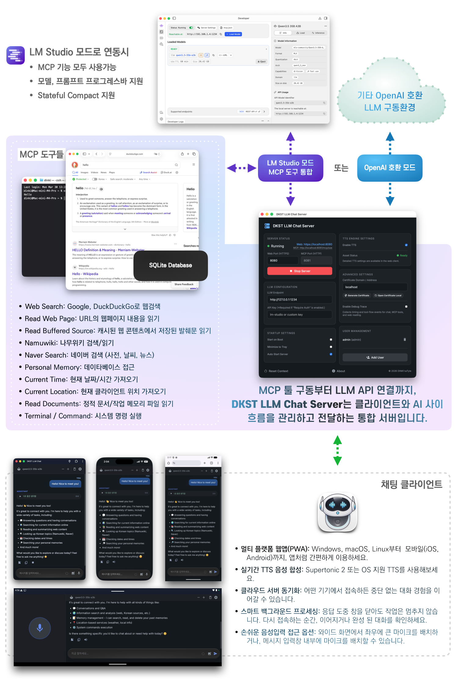

<!--
Created by DINKIssTyle on 2026.
Copyright (C) 2026 DINKI'ssTyle. All rights reserved.
-->

  

# DINKIssTyle Local LLM Gateway with TTS & MCP

DINKIssTyle Local LLM Gateway는 강력한 지능형 기능을 결합한 차세대 로컬 LLM 웹 인터페이스입니다. LM Studio, Ollama 등 로컬 API 중계를 넘어, 독자적인 **MCP(Model Context Protocol)**와 Supertonic2 고품질 TTS를 통합해 탁월한 개인 비서 경험을 제공합니다.

특히 **FTS5와 Vector** 기반의 하이브리드 검색은 방대한 장기 기억을 초고속으로 인출하여 프리필(Pre-fill) 속도를 혁신적으로 단축합니다. 여기에 **유저 프로필 기억** 기능으로 개인화된 맞춤형 답변을 제공하며, 점수 평가 기반의 **지능형 망각 시스템**을 통해 불필요한 정보는 걸러내고 핵심적인 기억만을 유지함으로써 개인 비서로써의 품질을 높였습니다.

  

## 설치 및 빌드 (Installation & Build)

### 전제 조건
*   [Go](https://go.dev/) 1.18 이상
*   [Node.js](https://nodejs.org/) (npm)
*   Wails CLI 도구 설치: `go install github.com/wailsapp/wails/v2/cmd/wails@latest`

### 개발 모드 실행
**Wails dev**

### 빌드 방법
**macOS:** `./build-macOS.sh` | **Windows:** `build-Windows.bat` | **Linux:** `./build-Linux.sh`

## 사용법 (Usage)

1.  앱 실행 후 **Start Server**를 클릭합니다.
    *   **챗봇 접속 (UI)**: `https://localhost:8080`
    *   **API/MCP 연결**: `http://localhost:8081`
2.  **Settings**에서 연동할 로컬 LLM 주소를 입력합니다 (예: `http://localhost:1234`).
3.  저장 폴더 구조는 공통으로 다음처럼 사용합니다.
    *   인증서는 `cert/`
    *   SQLite 메모리 데이터베이스는 `memory/memory.db`
    *   발음 사전과 편집기는 `dictionary/`
    *   Supertonic 2 자산은 `assets/tts/supertonic2/`
    *   임베딩 모델은 `assets/embeddings/multilingual-e5-small/`
    *   ONNX Runtime은 `assets/runtime/onnxruntime/`
4.  채팅창에서 질문하거나, 이미지를 붙여넣어 비전 기능을 테스트하고, "내 생일은 1월 1일이야" 같이 말해 AI의 기억력을 확인해 보세요.

## 라이선스 (License)

Created by DINKIssTyle on 2026.
Copyright (C) 2026 DINKI'ssTyle. All rights reserved.
